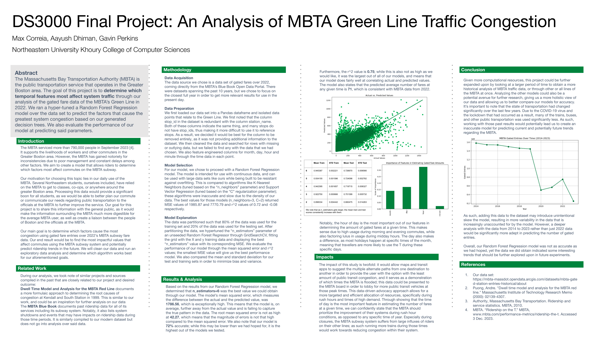

# DS3000 Final Project
## [Max Correia](https://github.com/maxcorreia), [Aayush Dhiman](https://github.com/aayushdhiman), Gavin Perkins
This repository contains the findings of our data congestion analysis of the MBTA's Green Line using Jupyter Notebook and Matplotlib in Python.

